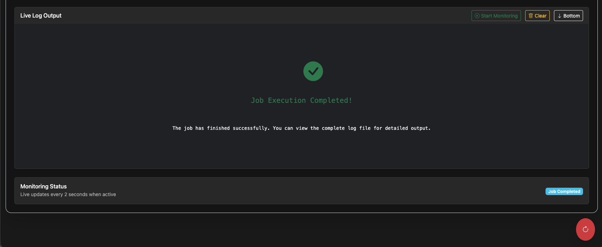

# Watchdog

I created this to automate my workflow and avoid manually SSH-ing into my Raspberry Pi to build the container and deploy it to the swarm, without needing to publish to a private registry.

```
¯\_(ツ)_/¯ 
```


# Start

To start the server, run:

```sh
sudo vim /etc/systemd/system/watchdog.service
```

Then paste the following:

ATTENTION: Change the paths and user/group to your own!

```ini
[Unit]
Description=Watchdog Ruby Server
After=network.target

[Service]
Type=simple
User=user
Group=user

WorkingDirectory=/home/user/watchdog
ExecStart=/home/user/.rbenv/shims/ruby /home/user/watchdog/server.rb
Restart=always
RestartSec=5
Environment=PROJECTS_PATH=/home/user/sites

[Install]
WantedBy=multi-user.target
```

then run:

```sh
sudo systemctl daemon-reload
sudo systemctl start watchdog.service
sudo systemctl enable watchdog.service
```

Logs:

```sh
journalctl -u watchdog.service -f
```

Restart:

```sh
sudo systemctl restart watchdog.service
```

Kill

```sh
sudo systemctl stop watchdog.service
```

# Screenshots





